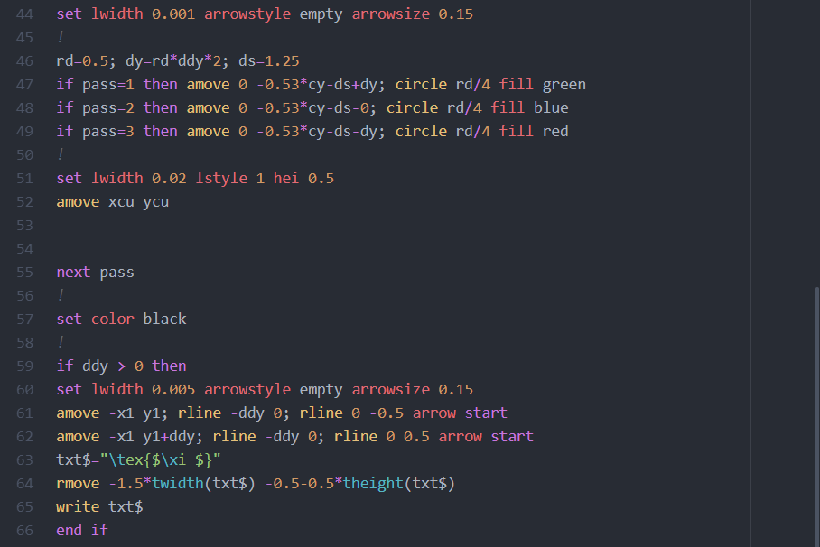

# language-gle package

## TODO

- Add TODO grammar
- Make `begin`/`end` special
- Maybe change the color for 'keyword_command'
- Code folding
- Parentheses pairing
- Clean garbage
- `\` in string
- Variable highlight in subroutine definition line.
- Add `d1`
- Add some missing operators
- `box`, `start`, `end`