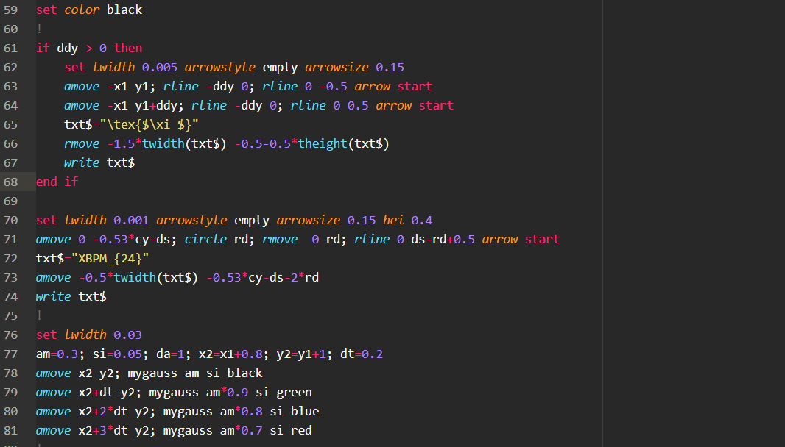

# language-gle package

## Tips

The recommended syntax theme to use with GLE package is [Monokai](https://atom.io/themes/monokai).

## TODO

- Add TODO grammar
- Make `begin`/`end` special
- Code folding
- Parentheses pairing
- Clean garbage
- Variable highlight in subroutine definition line.
- Add `d1`
- Add some missing operators
-  `start`, `end`
- Add what’s left in graphics primitives to `keyword_command`.